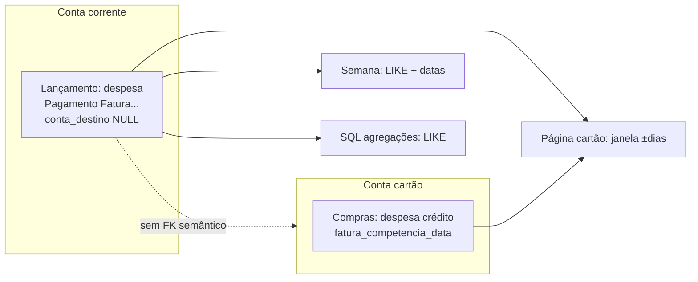
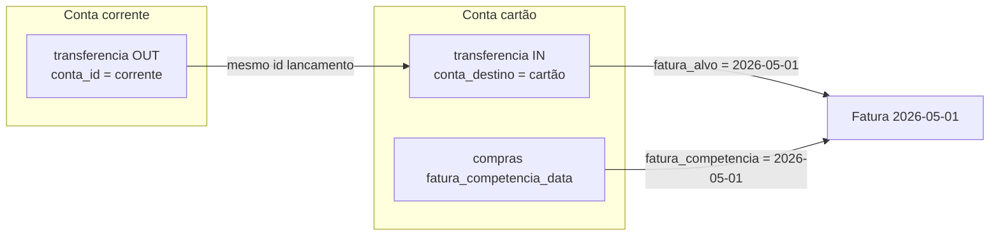

# Pagamento de fatura de cartão: estado atual, problemas e modelo desejado

**Documento técnico — LT CashFlow**  
**Versão:** 1.0  
**Data:** 12 de maio de 2026  
**Público:** produto, desenvolvimento e uso pessoal (reconciliação com banco)

---

## 1. Resumo executivo

Hoje o sistema registra o pagamento da fatura do cartão como **uma despesa na conta corrente**, identificada principalmente por **texto na descrição** (`Pagamento efetuado - Fatura Cartão Inter`, etc.). **Não existe no banco um campo que diga explicitamente qual fatura (qual ciclo) aquele pagamento abate.**

Isso faz com que cada tela (extrato da corrente, página do cartão, fechamento semanal, métricas) **reinterprete o mesmo conceito com regras diferentes** — janelas de data, `LIKE` em descrição, exclusão de “pagamento de fatura” dos totais de débito da semana, etc. O resultado é **divergência entre o app e o app do banco** (ex.: saldo em aberto da fatura “anterior”) e **dificuldade de cruzar** pagamento na corrente com redução de dívida no cartão.

O modelo desejado é: **uma única origem de verdade** — o pagamento nasce como **transferência da corrente para a conta do cartão**, com um **identificador explícito da fatura-alvo** (ex.: `fatura_alvo_competencia_data = '2026-05-01'`). Todas as telas leem esse mesmo registro; não há “o mesmo dado guardado em lugares diferentes com semânticas diferentes”.

---

## 2. Conceitos que não podem ser misturados

### 2.1 Conta corrente (caixa)

- Representa **dinheiro que você tem no banco**.
- **Saldo** = saldo inicial da conta + receitas − despesas − transferências que saem + transferências que entram.
- O “mês” do calendário **não** define o saldo: o saldo é **cumulativo** até hoje.

### 2.2 Cartão de crédito (passivo / compromisso)

- Cada compra no crédito **aumenta** o que você deve à operadora (até pagar).
- O banco organiza isso em **ciclos de fatura** (entre um fechamento e outro), não no “mês civil” da corrente.
- **Fatura** = conjunto de compras (e parcelas que caem naquele ciclo) + eventual saldo anterior não pago.
- **Pagamento da fatura** = dinheiro sai da corrente e **reduz** a dívida do cartão. No mundo real é um **movimento entre duas “bolsas”** (corrente ↔ dívida do cartão), não “uma nova despesa” no sentido de consumo.

### 2.3 Ciclo da fatura vs “próximo mês”

- **Não** é o mesmo que “virou o mês na corrente”.
- Uma compra feita **depois do dia de fechamento** entra na **próxima fatura** (próximo ciclo), mesmo que a data de compra ainda seja no mesmo mês civil.
- **Parcelamentos**: a data da **compra original** pode ser antiga; o que importa para o banco é **em qual fatura aquela parcela aparece** — isso no app está em `fatura_competencia_data` nas compras (quando preenchido corretamente).

**Regra mental:** corrente = fluxo contínuo; cartão = **série de ciclos** (fechamento/vencimento). O pagamento liga os dois mundos e **precisa** saber **qual ciclo** está sendo quitado (ou parcialmente quitado).

---

## 3. Estado atual (como está implementado)

### 3.1 Tabela principal: `lancamentos`

Campos relevantes hoje (conceitualmente):

| Campo | Uso típico |
|--------|------------|
| `tipo` | `receita`, `despesa`, `transferencia`, `ajuste` |
| `conta_id` | Conta de origem da movimentação |
| `conta_destino_id` | Destino em **transferências**; muitas vezes `NULL` em outras linhas |
| `meio` | `credito` para compras no cartão; pagamentos de fatura nos seeds usam `transferencia` como meio mas **tipo continua `despesa`** na corrente |
| `competencia_data` | Data contábil / extrato |
| `fatura_competencia_data` | Em compras no cartão: **primeiro dia do mês da fatura** em que a compra (ou parcela) cai |
| *(não existe)* | **Campo explícito “esta linha paga a fatura X”** para pagamentos |

### 3.2 Compras no cartão

- Modelo: `tipo = 'despesa'`, `conta_id =` conta do cartão, `meio = 'credito'`.
- `fatura_competencia_data` deve indicar **em qual fatura** a compra entra.
- Há função `computeFaturaCompetenciaParaCompra` no repositório (regra baseada em `fechamento_dia` da conta) para preencher automaticamente em novos lançamentos quando ausente.

### 3.3 Pagamento da fatura (como está na base hoje)

Padrão observado nos scripts de seed e em produção:

- `tipo = 'despesa'`
- `conta_id =` conta **corrente** (ex.: id 1)
- `conta_destino_id = NULL`
- `descricao` contendo texto do tipo `Pagamento efetuado - Fatura Cartão Inter` ou `%Fatura Cartão%` / `%Fatura Cartao%`

**Consequência:** o sistema **não liga** formalmente essa linha à conta do cartão nem à fatura `YYYY-MM-01`. A “ligação” é **inferida** por:

- padrão de texto na descrição;
- e, em alguns lugares, **intervalo de datas** em torno do primeiro dia do mês da fatura.

### 3.4 Onde esse dado é “consumido” hoje (múltiplas leituras)

| Área | Arquivo / função (referência) | Como interpreta pagamento de fatura |
|------|-------------------------------|--------------------------------------|
| Resumo semanal — total de pagamentos na semana | `getSemanaPagamentosFatura` em `repository.ts` | Soma `despesa` na corrente, `competencia_data` entre início e fim da semana, descrição com `%Fatura Cartão%` |
| Página cartão — “pago neste ciclo” (aproximação) | `getPagamentosFaturaParaCiclo` em `repository.ts` | Soma `despesa` na corrente com descrição de fatura e `competencia_data` entre **`fatura_ref - 7 dias`** e **`fatura_ref + 14 dias`** |
| Resumo corrente / exclusão de “débito” | `SQL_NOT_PAGAMENTO_FATURA` / `SQL_PAGAMENTO_FATURA` em `repository.ts` | Exclui ou inclui linhas por **LIKE** na descrição |
| Extrato (tabela recente) | `recent-lancamentos-table.tsx` | Trata transferências e ignora compras de cartão no saldo da corrente; pagamentos como despesa seguem regras do componente |
| Fechamento semanal (UI) | `page.tsx` + métricas | Usa `getSemanaPagamentosFatura` para exibir valor “no extrato” da semana |

Nenhum desses pontos tem, hoje, um **ID de fatura** ou **data-canônica da fatura-alvo** vinda do próprio lançamento de pagamento.

### 3.5 Por que isso gera divergência com o banco

1. **Pagamento parcial ou rateado** em datas que caem fora da janela ±7/+14 dias em relação a `YYYY-MM-01` escolhido para o ciclo na UI — some ou some em dobro na página do cartão.
2. **Um pagamento que o banco aplica na fatura B** foi lançado no app com `competencia_data` que, heuristicamente, parece ligado à fatura A — o saldo em aberto da fatura A no app **não bate** com o Inter.
3. **Descrições** levemente diferentes (`Cartão` vs `Cartao`, outro banco) — risco de não entrar em algum `LIKE`.
4. **Dupla contagem conceitual**: financeiramente o pagamento “abate cartão”; na modelagem atual ele é só “saída da corrente” até alguém cruzar com o cartão manualmente ou por heurística.

---

## 4. O que deveria ser (fonte única de verdade)

### 4.1 Princípio

> **Todo pagamento de fatura é um único evento contábil:** saída de caixa (corrente) e redução de passivo (cartão), com **referência explícita à fatura (ciclo) afetada**.

Não deve existir segunda representação “sombra” do mesmo pagamento só para o cartão.

### 4.2 Modelo de dados recomendado

**Opção A (preferida — um lançamento):**

- `tipo = 'transferencia'`
- `conta_id` = corrente (origem)
- `conta_destino_id` = conta cartão (destino “conta passivo” no app)
- `valor_total` = valor pago
- `competencia_data` = data em que o dinheiro saiu da corrente (extrato)
- **Novo campo:** `fatura_alvo_competencia_data DATE NULL`  
  - Significado: **qual fatura** (identificada pelo primeiro dia do mês de competência da fatura, ex. `2026-05-01`) esse pagamento abate.
  - Permite pagamento parcial: várias transferências com o mesmo `fatura_alvo`.
- `descricao` = texto legível (pode manter padrão atual para auditoria humana)

**Opção B (dois lançamentos amarrados — só se houver requisito legal/contábil):** par debitado/creditado com `grupo_id`. Maior complexidade; não necessário para uso pessoal na maioria dos casos.

### 4.3 Como cada tela lê (depois da mudança)

| Área | Leitura |
|------|---------|
| Extrato corrente | Linhas onde `conta_id = corrente` — transferências saem como já saem hoje |
| Extrato / resumo cartão | `SUM(valor)` onde `tipo = transferencia` AND `conta_destino_id = cartão` AND `fatura_alvo_competencia_data = :fatura` |
| Saldo em aberto da fatura X | `SUM(compras na fatura X) - SUM(pagamentos com fatura_alvo = X)` |
| Fechamento semanal | Mesma soma: transferências classificadas como “pagamento fatura” **ou** filtro `fatura_alvo IS NOT NULL` + data na semana |
| IA / importação | Criar sempre com `fatura_alvo` preenchido; validação na API |

**Nada** de `LIKE '%Fatura Cartão%'` como regra de negócio principal — no máximo migração ou legado temporário.

### 4.4 Relação com `fatura_competencia_data` das compras

- **Compra:** `fatura_competencia_data` = em qual fatura a dívida **entrou**.
- **Pagamento:** `fatura_alvo_competencia_data` = em qual fatura a dívida **saiu** (foi paga).

Assim o cruzamento é direto: mesma chave `YYYY-MM-01` nos dois lados do problema.

---

## 5. Diagrama conceitual (estado atual vs desejado)

### 5.1 Hoje (inferência + texto)



### 5.2 Desejado (referência explícita)



---

## 6. Plano de migração (alto nível)

1. **Migration:** adicionar `fatura_alvo_competencia_data` (nullable) em `lancamentos`; documentar em `schema.sql`.
2. **Backfill:** para cada linha atual de pagamento de fatura (despesa na corrente com padrão conhecido):
   - converter para `transferencia` corrente → cartão **ou** criar par consistente, conforme decisão de schema;
   - preencher `fatura_alvo_competencia_data` com regra assistida + **revisão humana** nos casos ambíguos (ex.: pagamento único que o banco rateia entre duas faturas).
3. **Ajustar writes:** fechamento semanal, importação, IA, formulário manual — sempre preenchem `fatura_alvo`.
4. **Ajustar reads:** remover dependência de janela ±7/+14 na página do cartão; usar só soma por `fatura_alvo`.
5. **Testes / reconciliação:** para cada fatura fechada, comparar total compras − total pagamentos com PDF do Inter.

---

## 7. Critérios de aceite (definição de pronto)

- Dado um PDF de fatura do Inter com total **T** e pagamentos listados **P1..Pn**, o app reproduz **T** e cada **Pi** com mesmo valor e data (±1 dia se timezone).
- Nenhuma tela calcula “pagamento de fatura” só por `LIKE` sem campo estruturado (exceto camada de migração).
- Documentação de onboarding explica: compra tem `fatura_competencia_data`; pagamento tem `fatura_alvo_competencia_data`.

---

## 8. Glossário rápido

| Termo | Significado no LT CashFlow |
|--------|----------------------------|
| `fatura_competencia_data` | Mês-ciclo (dia 01) em que a **compra** entrou na fatura |
| `fatura_alvo_competencia_data` (proposto) | Mês-ciclo (dia 01) que o **pagamento** abate |
| `fechamento_dia` / `vencimento_dia` | Metadados da conta cartão; usados para calcular em qual fatura cai uma compra |

---

## 9. Referências de código (para desenvolvimento)

- `apps/web/src/lib/server/repository.ts` — `getSemanaPagamentosFatura`, `getPagamentosFaturaParaCiclo`, `SQL_PAGAMENTO_FATURA`, `computeFaturaCompetenciaParaCompra`, `createLancamento`
- `apps/web/src/app/dashboard/cartao/page.tsx` — resumo do ciclo e lista filtrada por fatura
- `apps/web/src/app/dashboard/semana/page.tsx` — uso de `getSemanaPagamentosFatura`
- `apps/web/src/components/dashboard/recent-lancamentos-table.tsx` — saldo corrente e filtros de cartão
- Seeds: `backend/database/scripts/seed_*_lote.sql` — exemplos de linhas `Pagamento efetuado - Fatura Cartão Inter`

---

## 10. Arquivos entregues

| Arquivo | Descrição |
|---------|-----------|
| `docs/modelagem-pagamento-fatura-cartao-fonte-unica.md` | Fonte Markdown (edição futura) |
| `docs/modelagem-pagamento-fatura-cartao-fonte-unica.print.html` | HTML para impressão / regenerar PDF |
| `docs/modelagem-pagamento-fatura-cartao-fonte-unica.pdf` | **PDF** gerado (Chrome headless) |

Para regenerar o PDF após editar o HTML:

```bash
google-chrome --headless=new --disable-gpu --no-pdf-header-footer \
  --print-to-pdf="docs/modelagem-pagamento-fatura-cartao-fonte-unica.pdf" \
  "file://$PWD/docs/modelagem-pagamento-fatura-cartao-fonte-unica.print.html"
```

---

*Fim do documento.*
